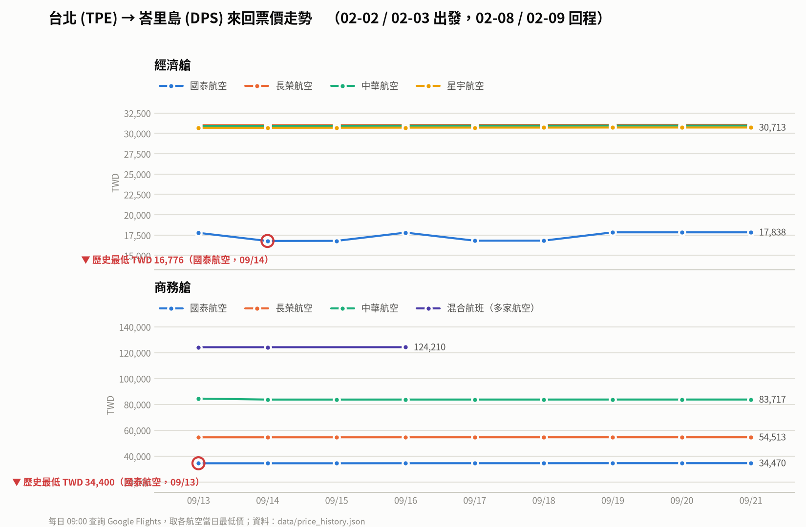

# ✈️ 台北 → 峇里島 機票價格監控

每天 **台北時間早上 09:00** 由 GitHub Actions 自動查詢 **TPE → DPS** 來回機票，
比較 **經濟艙、豪華經濟艙、商務艙** 三種艙等的最低價，只要任一艙等價格
**低於上一次查價** 或 **低於歷史最低價**，就寄 Email 到 `anderson030323@gmail.com` 通知你。

## 📈 每日價格走勢



每天查價後自動更新；每家航空一條線，紅圈為監控以來的歷史最低。
原始資料：[`data/price_history.json`](data/price_history.json)（完整 JSON）與
[`data/prices.csv`](data/prices.csv)（每日 × 艙等 × 航空 的表格，可直接用 Excel 開）。

## 運作方式

1. `.github/workflows/flight-monitor.yml` 依排程（`0 1 * * *` UTC = 09:00 台北）執行。
2. `monitor/flight_monitor.py` 透過 [fast-flights](https://github.com/AWeirdDev/flights) 直接查詢 **Google Flights**
   （免費、不需要 API key）。預設條件：
   - 出發 **2027-02-02 或 02-03**，回程 **2027-02-08 或 02-09**（4 種組合都查，取最低）
   - 只計入 **長榮 (BR)、華航 (CI)、國泰 (CX)、星宇 (JX)、阿聯酋 (EK)** 全程營運的航班
3. 每次結果寫入 `data/price_history.json` 與 `data/prices.csv`，並由 `monitor/plot_history.py`
   重繪 `charts/price_trend.png`，三者一起自動 commit。走勢圖也會內嵌在通知信裡。
4. 比較兩個基準：**上一次查價**（前一天的價格）與 **歷史最低價**。
   任一艙等低於其中一個 → 寄 Email 通知（信中會標示 📉 降價幅度 / 🔥 歷史新低）。
   Email 沒設定或寄送失敗時，改開 GitHub Issue 當備援。
5. 每次執行的完整結果也會顯示在 Actions 的 Job Summary。

## 一次性設定（必要）

查價本身不需要任何金鑰，唯一要設定的是寄信用的 Gmail。

### 設定 Gmail 寄信（Email 通知）

通知信預設寄到 `anderson030323@gmail.com`，透過 Gmail SMTP 寄出，需要一組「應用程式密碼」：

1. 用要「寄信」的 Gmail 帳號（可以就是 anderson030323@gmail.com）登入 <https://myaccount.google.com/security>，
   確認已開啟 **兩步驗證**。
2. 到 <https://myaccount.google.com/apppasswords>，建立一組應用程式密碼（名稱隨意，例如 `flight-monitor`），
   會得到 16 碼密碼。
3. 到 GitHub repo → **Settings → Secrets and variables → Actions** 新增：

| Secret 名稱 | 內容 |
| --- | --- |
| `SMTP_USER` | 寄信用的 Gmail 地址，例如 `anderson030323@gmail.com` |
| `SMTP_PASSWORD` | 上一步取得的 16 碼應用程式密碼 |

> 若要改收件人，在 **Variables** 新增 `NOTIFY_EMAIL_TO`。
> 若沒設定 Email，通知會改用 GitHub Issue（需 Watch 這個 repo 才會收到 GitHub 的信）。

## 可選：其他通知管道

| 管道 | 需要的 Secrets / Variables |
| --- | --- |
| Telegram | Secrets `TELEGRAM_BOT_TOKEN`、`TELEGRAM_CHAT_ID`（用 @BotFather 建 bot，再用 @userinfobot 查自己的 chat id） |
| 其他 SMTP 服務 | Variables `SMTP_HOST`、`SMTP_PORT`（預設 `smtp.gmail.com` / `587`） |

## 可選：調整搜尋條件

到 **Settings → Secrets and variables → Actions → Variables** 新增：

| Variable | 預設 | 說明 |
| --- | --- | --- |
| `DEPARTURE_DATES` | `2027-02-02,2027-02-03` | 出發日期（逗號分隔） |
| `RETURN_DATES` | `2027-02-08,2027-02-09` | 回程日期（逗號分隔），會和每個出發日配對 |
| `AIRLINES` | `BR,CI,CX,JX,EK` | 目標航空公司 IATA 代碼；清空 = 不限航空 |
| `TRIP_NIGHTS` | `5` | 清空 `RETURN_DATES` 時改用「出發日 + N 晚」；設 `0` 查單程 |
| `DAYS_AHEAD` | `30,45,60,90` | 清空 `DEPARTURE_DATES` 時改用「距今 N 天」取樣 |
| `MAX_STOPS` | 空（不限） | 最多轉機次數；`0` = 只看直飛 |
| `ADULTS` | `1` | 人數 |
| `CURRENCY` | `TWD` | 幣別 |
| `NOTIFY_ALWAYS` | `false` | 設 `true` 則每天都寄當日價格（不只降價時） |
| `ORIGIN` / `DESTINATION` | `TPE` / `DPS` | 可改成其他航線 |

## 手動執行 / 測試

Actions → **Daily TPE→DPS fare monitor → Run workflow**，
勾選 `notify_always` 可立即收到一封完整報價通知信，確認 Email 設定正常。

本機執行：

```bash
pip install -r requirements.txt
python monitor/flight_monitor.py
```

## 注意事項

- GitHub 排程有時會延遲數分鐘到數十分鐘，屬正常現象。
- 公開 repo 若 60 天沒有任何 commit，GitHub 會自動停用排程；本專案每天都會 commit 價格紀錄，所以不受影響。
- 「歷史新低」是以本專案開始監控後的紀錄比較，第一次執行時三種艙等都會視為新低並通知一次。
- 「上一次查價」指前一次成功執行的價格；價格持平或上漲時不通知，但仍會記錄在 Job Summary 與歷史檔。
- 價格來自 Google Flights 搜尋結果頁，屬非官方介面。若 Google 改版導致查無資料，
  程式會回報錯誤（Actions 會顯示紅色），此時更新 `fast-flights` 套件版本通常即可修復。
  若 runner 被 Google 暫時封鎖，可在 Secrets 設 `GOOGLE_FLIGHTS_PROXY` 走代理。
- 通知信中每個艙等都附上對應的 Google Flights 連結，可直接點開確認並訂票。
- 某艙等顯示「沒有報價」代表 Google Flights 在該日期、該航空公司下查無此艙等
  （例如 2027/02 台北–峇里島目前查不到長榮／華航／國泰／星宇／阿聯酋的豪華經濟艙），
  一旦航空公司開賣，隔天的查價就會自動抓到並通知。
